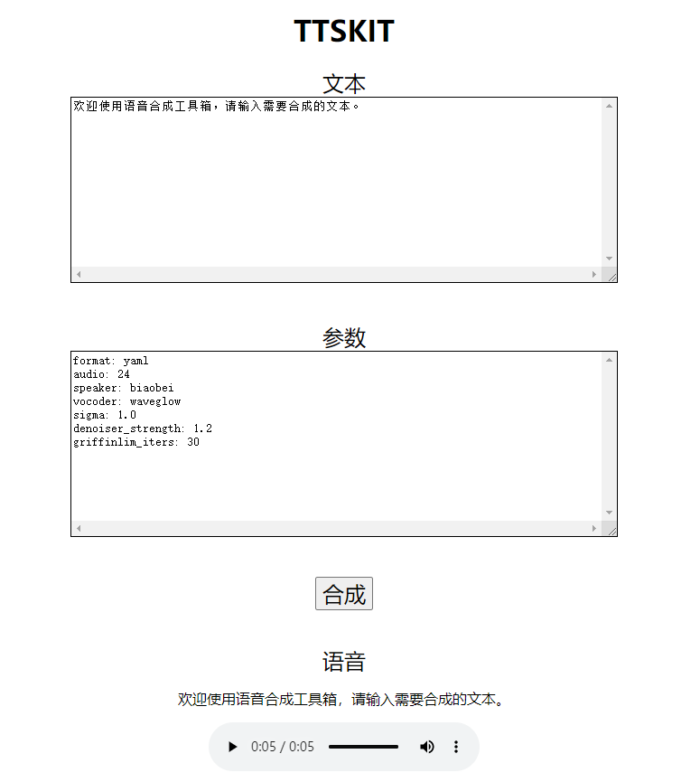

## ttskit
Text To Speech Toolkit: 语音合成工具箱。

### 安装

```
pip install -U ttskit
```

- 注意
    * 可能需另外安装的依赖包：torch，版本要求torch>=1.6.0,<=1.7.1，根据自己的实际环境安装合适cuda或cpu版本的torch。
    * ttskit的默认音频采样率为22.5k。
    * 自行设置环境变量CUDA_VISIBLE_DEVICES以调用GPU，如果不设置，则默认调用0号GPU，没有GPU则使用CPU。

### 资源
使用ttskit的过程中会自动下载模型和语音资源。

如果下载太慢或无法下载，也可自行从百度网盘下载，把下载的资源合并到ttskit目录下（更新resource目录）。

链接：https://pan.baidu.com/s/13RPGNEKrCX3fgiGl7P5bpw

提取码：b7hw

### 快速使用
```
import ttskit

ttskit.tts('这是个示例', audio='24')

# 参数介绍
'''语音合成函数式SDK接口，函数参数全部为字符串格式。
text为待合成的文本。
speaker为发音人名称，可选名称为_reference_audio_dict；默认的发音人名称列表见resource/reference_audio/__init__.py。
audio为发音人参考音频，如果是数字，则调用内置的语音作为发音人参考音频；如果是语音路径，则调用audio路径的语音作为发音人参考音频。
output为输出，如果以.wav结尾，则为保存语音文件的路径；如果以play开头，则合成语音后自动播放语音。
'''
```

### 版本
v0.1.7

### sdk_api
语音合成SDK接口。
本地函数式地调用语音合成。

+ 简单使用
```python
from ttskit import sdk_api

wav = sdk_api.tts_sdk('文本', audio='24')
```

### cli_api
语音合成命令行接口。
用命令行调用语音合成。

+ 简单使用
```python
from ttskit import cli_api

args = cli_api.parse_args()
cli_api.tts_cli(args)
# 命令行交互模式使用语音合成。
```

+ 命令行
```
tkcli

usage: tkcli [-h] [-i INTERACTION] [-t TEXT] [-s SPEAKER] [-a AUDIO]
             [-o OUTPUT] [-m MELLOTRON_PATH] [-w WAVEGLOW_PATH] [-g GE2E_PATH]
             [--mellotron_hparams_path MELLOTRON_HPARAMS_PATH]
             [--waveglow_kwargs_json WAVEGLOW_KWARGS_JSON]

语音合成命令行。

optional arguments:
  -h, --help            show this help message and exit
  -i INTERACTION, --interaction INTERACTION
                        是否交互，如果1则交互，如果0则不交互。交互模式下：如果不输入文本或发音人，则为随机。如果输入文本为exit
                        ，则退出。
  -t TEXT, --text TEXT  Input text content
  -s SPEAKER, --speaker SPEAKER
                        Input speaker name
  -a AUDIO, --audio AUDIO
                        Input audio path or audio index
  -o OUTPUT, --output OUTPUT
                        Output audio path. 如果play开头，则播放合成语音；如果.wav结尾，则保存语音。
  -m MELLOTRON_PATH, --mellotron_path MELLOTRON_PATH
                        Mellotron model file path
  -w WAVEGLOW_PATH, --waveglow_path WAVEGLOW_PATH
                        WaveGlow model file path
  -g GE2E_PATH, --ge2e_path GE2E_PATH
                        Ge2e model file path
  --mellotron_hparams_path MELLOTRON_HPARAMS_PATH
                        Mellotron hparams json file path
  --waveglow_kwargs_json WAVEGLOW_KWARGS_JSON
                        Waveglow kwargs json
```


### web_api
语音合成WEB接口。
构建简单的语音合成服务。

+ 简单使用
```python
from ttskit import web_api

web_api.app.run(host='0.0.0.0', port=2718, debug=False)
# 用POST或GET方法请求：http://localhost:2718/tts，传入参数text、audio、speaker。
# 例如GET方法请求：http://localhost:2718/tts?text=这是个例子&audio=2
```

+ 使用说明

### http_server
语音合成简易界面。
构建简单的语音合成网页服务。

+ 简单使用
```python
from ttskit import http_server

http_server.start_sever()
# 打开网页：http://localhost:9000/ttskit
```

+ 命令行
```
tkhttp

usage: tkhttp [-h] [--device DEVICE] [--host HOST] [--port PORT]

optional arguments:
  -h, --help       show this help message and exit
  --device DEVICE  设置预测时使用的显卡,使用CPU设置成-1即可
  --host HOST      IP地址
  --port PORT      端口号
```

+ 网页界面


### resource
模型数据等资源。

audio
model
reference_audio

+ 内置发音人映射表

```python
_speaker_dict = {
    1: 'Aibao', 2: 'Aicheng', 3: 'Aida', 4: 'Aijia', 5: 'Aijing',
    6: 'Aimei', 7: 'Aina', 8: 'Aiqi', 9: 'Aitong', 10: 'Aiwei',
    11: 'Aixia', 12: 'Aiya', 13: 'Aiyu', 14: 'Aiyue', 15: 'Siyue',
    16: 'Xiaobei', 17: 'Xiaogang', 18: 'Xiaomei', 19: 'Xiaomeng', 20: 'Xiaowei',
    21: 'Xiaoxue', 22: 'Xiaoyun', 23: 'Yina', 24: 'biaobei', 25: 'cctvfa',
    26: 'cctvfb', 27: 'cctvma', 28: 'cctvmb', 29: 'cctvmc', 30: 'cctvmd'
}
```

### encoder
声音编码器。

### mellotron
语音合成器。

### waveglow
声码器。
